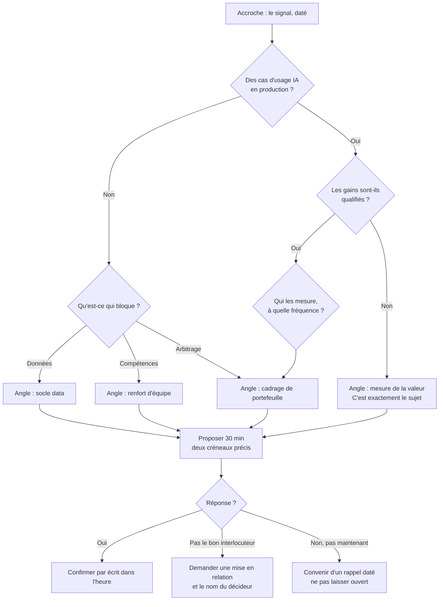

# Suivi, discours et sparring de prospection (Skill 4)

**Entrée** : la base Notion « Pipeline prospection », ou des entreprises avec signaux et contacts connus.
**Sortie** : selon le mode, un rapport de suivi, une séquence, une fiche de contact, un brief d'appel ou un sparring.

## Objectif

Une fois la campagne lancée, cinq besoins reviennent : savoir qui relancer, en combien de touches et sur quels canaux, quoi écrire de personnalisé, quoi dire au téléphone, et comment répondre aux blocages. Cinq modes, à utiliser séparément.

## Ce que cette skill n'envoie jamais

Aucun mode n'envoie de message, de mail ou de notification — ni au prospect, ni en interne. Elle rédige et elle rapporte. L'envoi reste une action humaine : le contact avec de vrais prospects engage l'image du cabinet.

## Ce qui se produit une fois, et ce qui se produit par entreprise

C'est la règle d'économie du plugin. La confondre revient à refaire vingt fois le même travail sur un Top 20.

| Livrable | Fréquence |
|---|---|
| Séquence de campagne (Mode 2) | **Une fois par campagne** |
| Arbre de qualification d'appel (Mode 4) | **Un par famille de cible** — deux à quatre sur un Top 20, jamais un par entreprise |
| Message (Mode 3) | **Par entreprise** — c'est la personnalisation qui fait la valeur, elle ne se mutualise pas |
| Brief d'appel (Mode 4) | **Par entreprise**, mais court : cinq lignes qui se branchent sur l'arbre commun |
| Sparring approfondi (Mode 5) | **À la demande**, sur une entreprise à enjeu |

Le socle commun se construit d'abord, une seule fois. Ensuite, chaque entreprise ne coûte qu'un message et cinq lignes de brief.

## Ordre de traitement

Suivre le classement de `ranking-entreprises-cibles` (Skill 3.5) quand il existe, plutôt que l'ordre brut du Top 20. S'il porte encore la mention « en attente de validation », attendre la validation humaine.

---

## Mode 1 — Rapport de suivi

Lecture seule de la base « Pipeline prospection », dans la page « PoC Prospection ». Une base homonyme héritée existe ailleurs : en cas de doublon, retenir la plus récemment modifiée et le dire.

Pour chaque prospect, lire l'état des trois étapes — message LinkedIn, mail, appel — et leurs dates, puis appliquer la cadence de la campagne (Mode 2).

Trois points de vigilance :

- **Un message rédigé n'est pas un message envoyé.** L'état intermédiaire, celui d'un message prêt que personne n'a envoyé, est le plus fréquent des oublis. Le sortir dans une section à part.
- **Une donnée manquante se signale**, elle ne se devine pas. Sans date d'envoi, pas d'échéance calculable.
- **Réveil à six mois.** Le cycle de prospection se rejoue environ tous les six mois. Lister à part les prospects clos sans réponse il y a plus de six mois : ils redeviennent contactables avec un angle neuf.

Restituer un tableau trié par urgence : prospect, entreprise, qui le suit, étape due, depuis combien de temps, dernier signal connu, action à faire.

**Une seule métrique compte** : le nombre de réponses positives rapporté au nombre de messages envoyés. Ni le taux d'ouverture, ni le volume envoyé. Le calculer quand la base le permet, le dire quand elle ne le permet pas.

---

## Mode 2 — Construire la séquence de campagne

Une prospection ne se joue pas en un message. Compter **5 à 8 contacts** avant de conclure à un échec ; les retours d'expérience du secteur montent à 7 à 10 interactions, en alternant les canaux. Deux messages LinkedIn d'affilée sans appel intercalé affaiblissent la séquence.

Trois cadences coexistent chez NDA. **Faire choisir**, ne pas trancher seul :

| Cadence | Rythme | Origine |
|---|---|---|
| Resserrée | J1 message · J2 relance · J3 appel | Méthode du prospecteur |
| PoC | J0 · J+3 · J+5 · J+10 | Workflow du PoC |
| Référentiel Sales NDA | J0 · J+3 · J+7 (téléphone) · J+14 | Référentiel interne officiel |

Deux règles issues du référentiel maison :

- **Ne pas joindre de note à l'invitation LinkedIn.** Elle n'améliore pas l'acceptation ; le message vient après. Si une note est malgré tout demandée : 200 caractères sur un compte gratuit, 300 avec Premium.
- **Le message de rupture est la touche la plus rentable.** Il ne relance pas, il demande une réorientation interne — et l'interlocuteur redirige souvent vers la bonne personne.

**La relance par mail n'est pas activée aujourd'hui.** Elle reste dans la séquence comme jalon méthodologique. Le jour où elle le sera, son principe est de rappeler le message précédent, d'apporter une référence client comparable et de proposer des créneaux précis — pas de répéter l'accroche.

---

## Mode 3 — Fiche de contact et message

Le livrable est un tableau, une ligne par contact.

**Prérequis bloquants** : contact et poste connus (Skill 2), signal daté et sourcé (Skill 3), et vérification que le prospect n'est pas déjà travaillé par un autre collaborateur. À défaut, le dire et proposer de lancer la skill manquante plutôt que de deviner.

### Structure du message

Celle du corpus NDA validé, en cinq temps :

1. **Caution** — un fait précis et daté sur l'entreprise, qui justifie que NDA écrive. Jamais une généralité sectorielle.
2. **Le défi induit**, en une phrase.
3. **Preuve sociale nommée** — « on accompagne [client] sur… ». Une référence réelle.
4. **Bénéfice potentiel**, sans pitch complet.
5. **Proposition d'échange** — « 30 min pour vous partager un REX ? ».

Le message répond à trois questions : **pourquoi agir, pourquoi NDA, pourquoi maintenant**.

**Longueur** : le corpus validé tourne autour de 700 à 1 000 caractères. Un message plus court peut convertir mieux, mais aucune version courte n'a été testée chez NDA — ne pas raccourcir sans le signaler comme un écart.

**Demande de rendez-vous dès le premier message : oui.** Tous les messages validés se terminent par une proposition de créneau.

**Variabilisation** : écrire avec des marqueurs explicites — `[Prénom]`, `[phrase de signal]`, `[référence client]` — pour décliner sans réécrire. Aucun marqueur ne doit rester en place.

### Adapter au persona

Le socle ne change pas ; la couche d'adaptation, oui.

| Persona | Angle |
|---|---|
| CTO / DSI | Technique : scalabilité, dette technique, charge de l'équipe |
| RSSI | Risque et conformité (NIS2, DORA, RGPD), sans ton anxiogène |
| CDO / Directeur Data-IA | Valeur métier : cas d'usage, ROI comparable |
| Directeur métier | Impact sur son périmètre, pas sur le SI |
| Direction générale | Stratégique : positionnement, transformation à l'échelle |
| Inconnu | Business générique, sans deviner |

La séniorité change le registre autant que la fonction : à un opérationnel on parle de ce qui lui prend du temps, à un manager de ce qui bloque son équipe, à un dirigeant d'arbitrage et de risque. Un décideur de haut niveau répond peu par écrit et davantage au téléphone — pour lui, privilégier l'appel.

Pour approfondir : [Selling to C-Suite Decision-Makers](https://reply.io/selling-to-c-suite/) et [Tailoring Messaging for Different Buyer Personas](https://blog.segment8.com/posts/messaging-persona-specific/).

### Relire, puis réécrire

Deux passes distinctes : d'abord relever tout ce qui échoue, ensuite réécrire. Corriger au fil de la lecture fait rater la moitié des défauts.

1. Pas de tiret cadratin — il casse le ton conversationnel.
2. Pas de question rhétorique du type « Vous galérez avec… ? ».
3. Pas de flatterie générique : un compliment cite un fait vérifiable, sinon il saute.
4. Pas de jargon — « leverage », « synergies », « best-in-class ».
5. Le premier mot n'est jamais « Je ».
6. Pas de tournure lisse du type « j'espère que vous allez bien ».
7. Le fait d'accroche est daté et sourçable.
8. La référence client est réelle et citable publiquement.
9. Aucun marqueur `[…]` laissé en place.
10. Objet de mail, le cas échéant : 6 mots maximum, spécifique. Jamais « Question rapide ».

**Trois manquements bloquent la livraison** : un fait inventé, une référence client inventée, un marqueur non rempli. Dans ces cas, ne pas livrer — dire ce qui manque et le demander.

### Sortie

Sur une liste, produire tous les messages dans un seul tableau, une ligne par contact — pas un message par réponse. Le socle est commun, seules les variables changent : c'est ce qui rend un Top 20 traitable.

Un tableau : entreprise, prospect et poste, persona, lien LinkedIn, message, contrainte potentielle la plus probable, et 2 à 4 puces d'insights spécifiques (le signal utilisé et sa fraîcheur, pourquoi il ouvre une conversation, l'angle retenu).

Rappeler enfin les deux obligations du premier message : **indiquer d'où vient l'adresse** (RGPD art. 14) et **offrir un moyen simple de refus**. Détail dans `recherche-contacts-entreprise/references/rgpd-cnil.md`.

---

## Mode 4 — Arbre de qualification et brief d'appel

L'appel ne s'improvise pas. Un appel qui aboutit à un rendez-vous se joue en 2 à 5 minutes : ce que le prospecteur a sous les yeux doit tenir sur un écran.

Ce mode produit deux choses de nature différente, et c'est ce qui le rend économe.

### 4a — L'arbre de qualification : un par famille de cible

**L'arbre ne se construit pas sur les entreprises appelées.** Il se construit sur quatre niveaux, dont trois sont mutualisables :

| Niveau | Contenu | Portée |
|---|---|---|
| 0 | Critères de fit et critères rouges d'exclusion | Par campagne |
| 1 | La douleur et la métrique | **Par offre** |
| 2 | La formulation | **Par persona** |
| 3 | Le motif d'appel — une phrase adossée à un fait daté | **Par entreprise** |

Le Top 20 et les signaux n'alimentent que le niveau 3, c'est-à-dire une ligne du brief. Ils ne changent pas la structure.

**Sans offre définie, pas d'arbre.** Un Top 20 sans campagne cadrée ne permet de construire que le niveau 0 : le dire et renvoyer vers `discours-campagne-prospection` (Skill 0) plutôt que de produire un arbre creux.

Un arbre par entreprise coûte trop cher et ne sert à rien : le prospecteur n'apprendra pas vingt scripts. Un arbre unique pour tout un Top 20 est tout aussi faux : on ne qualifie pas un groupe public comme une enseigne privée, même avec la même offre.

**Le critère de découpage : dupliquer un arbre quand une question change, pas quand une réponse change.**

- « Êtes-vous soumis à la commande publique ? » se pose chez un acteur public, pas chez un distributeur privé. Question différente, donc arbre différent.
- Deux ETI agroalimentaires du même profil se qualifient avec les mêmes questions et donnent des réponses différentes. Même arbre, briefs différents.

Trois axes font bifurquer, dans cet ordre de fréquence :

| Axe | Ce qu'il change dans les questions |
|---|---|
| Public ou privé | Commande publique, souveraineté des données, cycle budgétaire annuel, durée du processus |
| Persona, quand il est vraiment éloigné | Un RSSI et un directeur métier n'ont pas les mêmes trois premières questions |
| Maturité du sujet chez la cible | « Avez-vous des cas d'usage ? » n'a pas de sens face à une entreprise qui en a cinquante |

Sur un Top 20, cela donne **deux à quatre arbres**. Constituer les familles avant de construire : regrouper les entreprises de la liste par famille, annoncer le regroupement, puis produire un arbre par groupe.

Avant de construire, vérifier qu'un arbre existe déjà pour cette famille sur cette campagne. Si oui, le réutiliser et proposer de l'amender plutôt que d'en produire un second.

Un compte à enjeu qui justifierait un traitement encore plus fin relève du Mode 5, pas d'un arbre supplémentaire.

Le principe est celui d'un script de centre d'appel : chaque réponse mène quelque part, aucun chemin ne s'arrête dans le vide, et tous convergent vers une proposition. Le produire en Mermaid, qui se lit aussi bien à l'écran qu'imprimé.

Gabarit à adapter au sujet de la campagne :

````markdown

````

Cinq règles de construction, toutes adossées à la méthodologie détaillée dans `references/qualification-appel.md` :

- **Un appel à froid n'est pas une découverte.** Il s'ouvre en disant pourquoi on appelle cette personne-là, pas par une série de questions. L'arbre est un filet de sécurité pour la suite de l'échange, jamais un questionnaire à dérouler.
- **Aucune branche morte.** « Non » mène quelque part, y compris à un rappel daté.
- **Une seule proposition à la fin**, pas trois options.
- **Cinq objections suffisent.** Pas intéressé, doute sur l'adéquation, pas de budget, pas mon périmètre, raccroché : elles couvrent les trois quarts des cas. Un arbre à trente branches est du sur-travail — mieux vaut soigner le motif d'appel, qui prévient l'objection.
- **Les nœuds viennent des objections du discours de campagne**, pas de l'imagination. Une objection prouvée mérite sa branche ; une hypothèse reste en note sous l'arbre.

Deux nœuds que les cadres classiques oublient et qu'il faut ajouter :

- **L'indécision.** Quatre à six affaires perdues sur dix le sont sans décision, pas au profit d'un concurrent. Trois questions : qui signe précisément, avez-vous déjà lancé puis arrêté un projet de ce type, que se passe-t-il pour vous si ça échoue.
- **Le circuit d'achat français.** Êtes-vous référencé, y a-t-il un panel fournisseur, quel est le délai de référencement. Pour un acheteur public : où en est la définition du besoin, existe-t-il déjà un accord-cadre.

Une remarque de méthode qui va à l'encontre d'une idée reçue : la supériorité des questions ouvertes n'est pas établie. Ce qui discrimine, c'est la séquence — faire formuler au prospect l'implication puis le gain — pas la forme grammaticale de la question.

L'arbre se met à jour au fil de la campagne : une objection réellement rencontrée au téléphone et absente de l'arbre s'y ajoute, et passe du statut hypothèse à validée dans le discours de campagne.

### 4b — Le brief : par entreprise, cinq lignes

Le brief ne redit pas l'arbre. Il donne ce que l'arbre ne peut pas savoir :

```markdown
**[Prospect]**, [poste] chez [Entreprise] — appel du [date]
- Signal : … (date, source)
- Référence à citer : …
- Contrainte probable pour eux : …
- Objectif : obtenir 30 min
- Arbre : [famille de cible dont relève cette entreprise]
```

Plus 5 à 8 bullet points d'appel si la personne les demande : accroche, question d'ouverture, deux arguments, la référence, la proposition de créneau.

Pour un Top 20, produire les briefs d'un coup, en tableau, regroupés sous l'arbre de leur famille. Chacun tient en cinq lignes : c'est tenable, contrairement à vingt arbres.

---

## Mode 5 — Sparring approfondi

Ce mode est l'exception, pas la règle. Il se déclenche à la demande, sur une entreprise à enjeu — un compte stratégique, un appel préparé de longue date — pas sur chaque ligne d'un Top 20. Pour le reste, la contrainte probable indiquée dans le brief suffit.

Pour cette entreprise précise, lister les contraintes et objections qu'*elle* peut soulever : conformité sectorielle, dépendance à un système existant, cycle de décision long, marché public. Pas les objections génériques de la Skill 0, celles qui tiennent à son contexte. Une réponse pour chacune.

**Partir des objections réellement entendues avant d'en imaginer.** La plus fréquente à ce jour : « on a déjà des cas d'usage », à laquelle NDA répond « vos cas d'usage sont en production — êtes-vous capables d'en qualifier les gains ? ». Distinguer dans le tableau ce qui a été rencontré de ce qui est anticipé : la première colonne se capitalise d'une campagne à l'autre, la seconde non.

Si le contexte réel de l'entreprise manque, le dire et proposer une recherche web rapide plutôt qu'inventer des contraintes plausibles mais non vérifiées.

```markdown
## Sparring — [Entreprise]

| Contrainte / objection | Rencontrée ou anticipée | Réponse proposée |
|---|---|---|
| … | … | … |
```

---

## Limites

Cette skill ne cherche pas d'entreprises (Skill 1), pas les contacts (Skill 2), pas les signaux (Skill 3), et n'envoie jamais rien.

Elle ne tient pas la base à jour : la saisie reste manuelle, et le rapport du Mode 1 ne vaut que ce que vaut la base au moment où il est produit.

Elle ne mémorise pas ce qui a marché — messages validés et taux de réponse ne sont pas relus d'une campagne à l'autre. En attendant, s'inspirer à la main des messages déjà validés du même secteur.

Si la demande sort de ces cinq modes, le dire clairement plutôt qu'improviser.

## Références

- `references/qualification-appel.md` — sur quoi se fonde un arbre de qualification, les cadres établis (FAINT, SPIN, SPICED, MEDDPICC, et pourquoi écarter BANT), les critères de disqualification, l'indécision comme premier concurrent, et ce que le circuit d'achat français change. Sources citées et classées par solidité.
